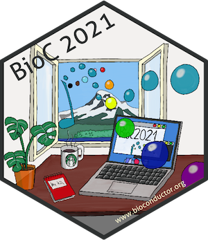

# POMA slides for the _BioC2021_ virtual conference 

<!--  -->       

This repository contains the [POMA](https://github.com/pcastellanoescuder/POMA) slides for the [BioC2021](https://bioc2021.bioconductor.org) conference.            

_BioC2021_ is a virtual conference (from Aug 4, 2021 to Aug 6, 2021) aimed at biologists, bioinformaticians, statisticians, programmers and software engineers who use or contribute to the [_Bioconductor_](https://www.bioconductor.org) project, or are interested in using _Bioconductor_.    
